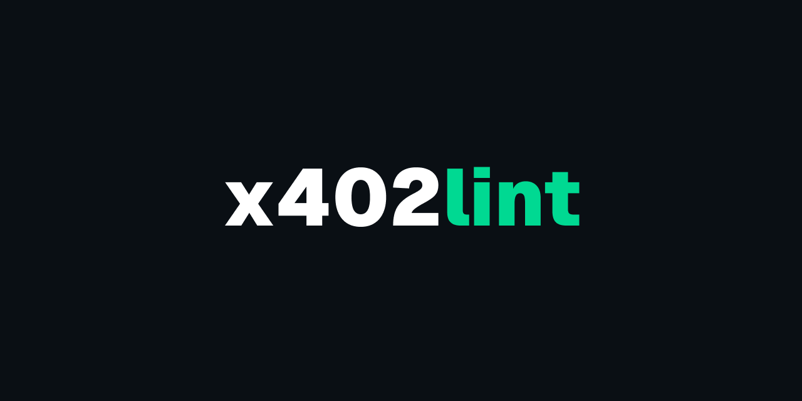

<p align="center">
  
</p>

# x402check

Validate [x402](https://www.x402.org/) payment configurations. Works in Node, browsers, and edge runtimes — zero dependencies.

**[x402check.com](https://www.x402check.com)** — try it in the browser

## Install

```
npm i x402check
```

## CLI

Validate configs from the command line — no code required.

```
npx x402check '{"x402Version":2,"accepts":[...]}'
npx x402check config.json
npx x402check https://api.example.com/resource
echo '...' | npx x402check
```

Flags:

| Flag | Description |
|------|-------------|
| `--strict` | Promote all warnings to errors |
| `--json` | Output raw JSON (for piping) |
| `--quiet` | Suppress output, exit code only |

Exit codes: `0` valid, `1` invalid, `2` input error.

Install globally with `npm i -g x402check` to use `x402check` directly.

## Quick start

```js
import { validate } from 'x402check'

const result = validate({
  x402Version: 2,
  accepts: [{
    scheme: 'exact',
    network: 'base',
    payTo: '0x1234567890abcdef1234567890abcdef12345678',
    asset: '0x833589fCD6eDb6E08f4c7C32D4f71b54bdA02913',
    amount: '10000',
    maxTimeoutSeconds: 300
  }]
})

result.valid      // true | false
result.errors     // ValidationIssue[]
result.warnings   // ValidationIssue[]
result.normalized // canonical v2 config
```

## API

### `check(response, options?)`

All-in-one: extracts config from an HTTP 402 response, validates it, and enriches with registry data (network names, asset symbols, decimals).

```js
import { check } from 'x402check'

const res = await fetch(url)
const result = check({
  body: await res.json(),
  headers: res.headers
})

result.extracted   // true | false
result.source      // 'body' | 'header' | null
result.valid       // true | false
result.errors      // ValidationIssue[]
result.warnings    // ValidationIssue[]
result.summary     // AcceptSummary[] — display-ready payment options
result.normalized  // canonical v2 config
```

Each `summary` entry includes `networkName`, `assetSymbol`, `assetDecimals`, and other registry-resolved fields.

### `validate(input, options?)`

Validates a config object or JSON string. Returns errors, warnings, and a normalized v2 config.

```js
validate(configOrJson)
validate(configOrJson, { strict: true }) // promotes warnings to errors
```

**Returns:** `ValidationResult`

```ts
{
  valid: boolean
  version: 'v2' | 'v1' | 'unknown'
  errors: ValidationIssue[]
  warnings: ValidationIssue[]
  normalized: NormalizedConfig | null
}
```

Each issue includes a machine-readable `code`, a `field` path, a human-readable `message`, and an optional `fix` suggestion.

### `extractConfig(response)`

Extracts an x402 config from an HTTP 402 response. Checks the JSON body first, then falls back to the `PAYMENT-REQUIRED` header (base64 or raw JSON).

```js
const res = await fetch(url)
const { config, source, error } = extractConfig({
  body: await res.json(),
  headers: res.headers
})
// source: 'body' | 'header' | null
```

### `detect(input)`

Returns the config format: `'v2'`, `'v1'`, or `'unknown'`.

```js
detect({ x402Version: 2, accepts: [...] }) // 'v2'
```

### `normalize(input)`

Converts any supported config to canonical v2 shape. Returns `null` if the format is unrecognized.

```js
const v2Config = normalize(v1Config)
```

### Address validation

```js
import { validateAddress, validateEvmAddress, validateSolanaAddress } from 'x402check'

validateAddress(addr, 'eip155:8453', 'payTo')   // dispatches by network
validateEvmAddress(addr, 'payTo')                // EIP-55 checksum verification
validateSolanaAddress(addr, 'payTo')             // base58, 32-byte decode check
```

### Network & asset registry

```js
import {
  isKnownNetwork, getNetworkInfo, getCanonicalNetwork,
  isKnownAsset, getAssetInfo, isValidCaip2
} from 'x402check'

isValidCaip2('eip155:8453')           // true
getCanonicalNetwork('base')           // 'eip155:8453'
getNetworkInfo('eip155:8453')         // { name: 'Base', type: 'evm', testnet: false }
isKnownAsset('eip155:8453', '0x833…') // true
getAssetInfo('eip155:8453', '0x833…') // { symbol: 'USDC', name: 'USD Coin', decimals: 6 }
```

## Supported formats

| Format | `x402Version` | Status |
|--------|---------------|--------|
| v2     | `2`           | Recommended |
| v1     | `1`           | Supported, auto-normalized to v2 |

## Validation checks

- Required fields (`scheme`, `network`, `amount`, `asset`, `payTo`)
- Amount is a numeric string > 0
- Network is valid [CAIP-2](https://github.com/ChainAgnostic/CAIPs/blob/main/CAIPs/caip-2.md)
- EVM addresses: `0x`-prefixed, 40 hex chars, EIP-55 checksum
- Solana addresses: base58, decodes to 32 bytes
- Known network and asset registry warnings
- `maxTimeoutSeconds` is a positive integer (if present)
- Resource URL format (if present)

## License

MIT
